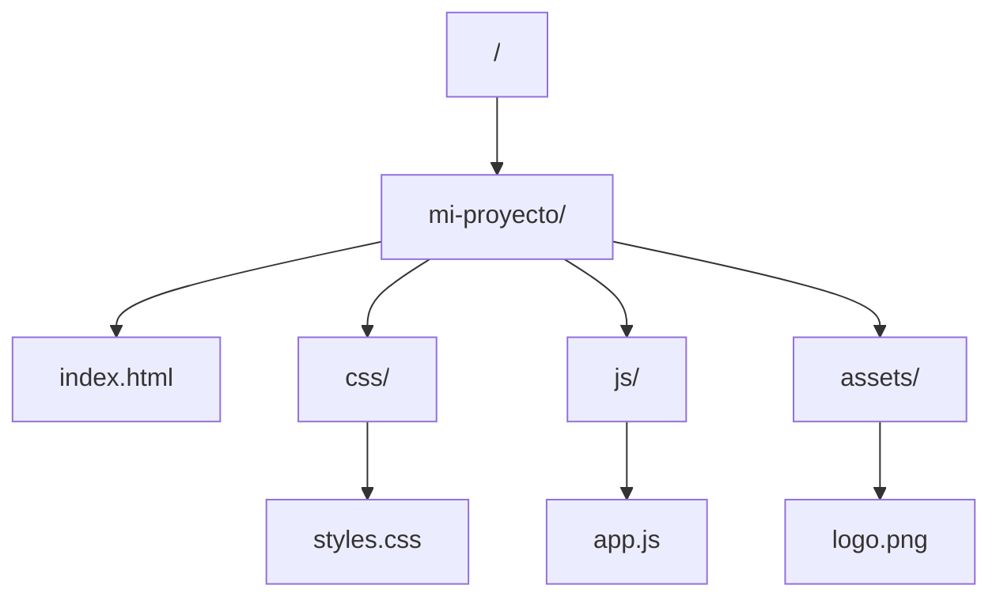

# Guia Docente: Fundamentos del Sistema de Archivos

Este documento convierte el resumen del modulo en una guia de clase online.
El foco es que el estudiante entienda estructura, rutas y organizacion de proyectos web.

## 1. Objetivos de aprendizaje

Al finalizar la clase, el estudiante deberia poder:

- Explicar la diferencia entre contenido de archivo y ubicacion de archivo.
    Como explicarlo: muestra un archivo correcto con ruta mal escrita para evidenciar que contenido y ubicacion son problemas distintos.
- Interpretar una estructura de directorios en arbol (padre, hijo, hermanos).
    Como explicarlo: dibuja un arbol simple y pide identificar relaciones entre carpetas.
- Usar rutas absolutas y relativas segun el contexto.
    Como explicarlo: compara desde donde parte cada ruta y cuando conviene una u otra.
- Evitar errores frecuentes de rutas en HTML, CSS y JS.
    Como explicarlo: corrige rutas rotas en un mini proyecto y verifica carga de recursos.
- Organizar carpetas de proyecto con buenas practicas de nombres.
    Como explicarlo: aplica convenciones de nombres y evalua impacto en colaboracion y despliegue.

## 2. Mapa tematico de la sesion

1. Contenido vs ubicacion.
2. Estructura jerarquica del sistema de archivos.
3. Rutas absolutas y rutas relativas.
4. `index.html` como punto de entrada comun.
5. Convenciones de nomenclatura y estructura sostenible.

## 3. Guion sugerido para clase online (75-90 minutos)

### Bloque A (15 min): Modelo mental correcto

- Presentar que un archivo no solo es bytes, tambien es contexto de ruta.
    Como explicarlo: resalta que el navegador necesita direccion exacta, no solo existencia del archivo.
- Mostrar error tipico: archivo existe, pero el navegador no lo encuentra.
    Como explicarlo: reproduce un 404 local y localiza la causa en la ruta referenciada.

### Bloque B (20 min): Jerarquia del sistema

- Explicar raiz, carpeta padre, hijo y hermanos.
    Como explicarlo: usa analogia de arbol genealogico para fijar relaciones de directorios.
- Dibujar en vivo una estructura simple de proyecto web.
    Como explicarlo: construye carpetas en pantalla y valida donde vive cada recurso.



### Bloque C (25 min): Rutas absolutas y relativas

- Ruta absoluta: inicia desde raiz.
    Como explicarlo: parte siempre del origen del sistema y sigue el camino completo.
- Ruta relativa: inicia desde el archivo actual.
    Como explicarlo: calcula paso a paso desde el archivo fuente hacia el destino.
- Practica guiada con ejemplos de `./`, `../` y subcarpetas.
    Como explicarlo: resuelve varios recorridos cortos hasta que el patron sea automatico.

```text
Desde index.html a css/styles.css -> css/styles.css
Desde css/styles.css a assets/logo.png -> ../assets/logo.png
```

### Bloque D (15 min): Buenas practicas de estructura

- Mantener niveles de anidacion razonables.
    Como explicarlo: compara una estructura plana y otra profunda para medir costo de mantenimiento.
- Usar minusculas, guiones y nombres semanticos.
    Como explicarlo: define una convencion unica y aplicala en todo el ejemplo.
- Evitar espacios, caracteres especiales y tildes en nombres.
    Como explicarlo: explica incompatibilidades comunes en servidores y herramientas de build.

### Bloque E (10 min): Mini evaluacion en vivo

- Resolver 3 rutas en pantalla compartida.
    Como explicarlo: pide justificar cada salto de carpeta para validar razonamiento, no memoria.
- Corregir 2 errores reales de estructura.
    Como explicarlo: primero detectar causa, luego aplicar arreglo minimo y volver a probar.

## 4. Checklist didactico por tema

- El estudiante puede explicar por que una ruta falla.
- Puede calcular una ruta relativa desde cualquier archivo.
- Puede proponer una estructura de carpetas clara para un proyecto pequeno.

## 5. Actividades practicas para clase

### Actividad 1 (parejas, 10 min)

Diseñar estructura de carpetas para landing + blog + assets compartidos.

### Actividad 2 (individual, 10 min)

Corregir 5 rutas rotas en un proyecto de ejemplo.

### Actividad 3 (cierre, 5 min)

Justificar en una frase por que `index.html` suele ser el punto de entrada.

## 6. Preguntas de comprobacion rapida

- Cuando conviene ruta absoluta y cuando relativa?
- Que significa `../` en una ruta?
- Por que `Logo.png` y `logo.png` pueden romper un despliegue en Linux?
- Que costo tiene una estructura demasiado anidada?

## 7. Errores frecuentes y como corregirlos

- Error: asumir que una ruta funciona igual en local y servidor.
    Correccion: validar estructura y case sensitivity en entorno Linux.
- Error: usar nombres inconsistentes de carpeta (`Img`, `img`, `images`).
    Correccion: definir convencion unica y aplicarla en todo el proyecto.
- Error: usar rutas relativas sin ubicar primero el archivo origen.
    Correccion: siempre partir del archivo actual y navegar paso a paso.

## 8. Cierre para la sesion

- Mensaje clave: estructura clara reduce bugs de integracion.
- Puente: dominar archivos y rutas simplifica Git, despliegue y colaboracion.
- Tarea: organizar un mini proyecto estatico con rutas 100 por ciento funcionales.

