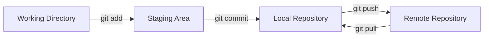

# Guia Docente: Git y el Ciclo de Vida del Desarrollo

Este documento transforma el resumen del modulo en una guia para clase online.
El objetivo es que el estudiante domine el flujo real de trabajo con Git,
desde cambios locales hasta colaboracion con repositorios remotos.

## 1. Objetivos de aprendizaje

Al finalizar la clase, el estudiante deberia poder:

- Explicar el modelo de tres estados: working directory, staging area y repository.
- Usar correctamente `git add`, `git commit`, `git push` y `git pull`.
- Interpretar `git status` y `git log` para diagnosticar el estado del proyecto.
- Crear historiales de commits claros, atomicos y trazables.
- Resolver situaciones basicas de conflicto sin perder trabajo.

## 2. Mapa tematico de la sesion

1. Modelo mental de Git y estados del archivo.
2. Comandos esenciales de configuracion y flujo diario.
3. Buenas practicas de commits y mensajes.
4. Ramas basicas para aislar cambios.
5. Sincronizacion con remoto y manejo inicial de conflictos.

## 3. Guion sugerido para clase online (90 minutos)

### Bloque A (15 min): Modelo mental

- Explicar Git como sistema de snapshots, no como "guardar versiones sueltas".
- Mostrar los 3 estados y el movimiento de cambios entre estados.

Diagrama para explicar en vivo:



### Bloque B (20 min): Flujo minimo diario

- `git status` para leer contexto antes de actuar.
- `git add` selectivo para construir commits atomicos.
- `git commit` con mensaje descriptivo y orientado a cambio.

Secuencia base:

```bash
git status
git add src/auth/login.js
git commit -m "feat(auth): validar formato de email"
```

### Bloque C (20 min): Historial y trazabilidad

- Usar `git log --oneline --graph` para entender historia del repo.
- Relacionar cada commit con una intencion concreta.
- Diferenciar commit de trabajo vs commit de entrega.

### Bloque D (20 min): Remoto y colaboracion basica

- `git push` y `git pull` como sincronizacion entre local y remoto.
- Caso comun: rechazo en push por cambios remotos.
- Estrategia segura: `git pull --rebase` (si el equipo lo permite) o merge clasico.

### Bloque E (15 min): Conflictos iniciales

- Identificar marcas de conflicto en archivo.
- Resolver manualmente y completar el ciclo con commit.

## 4. Actividades practicas para la clase

### Actividad 1 (parejas, 12 min)

Crear 3 commits atomicos sobre un mini proyecto:

- `feat`: nueva funcionalidad pequena.
- `fix`: corregir bug puntual.
- `docs`: actualizar README.

### Actividad 2 (parejas, 10 min)

Simular conflicto en el mismo archivo entre dos ramas y resolverlo.

### Actividad 3 (individual, 8 min)

Reescribir mensajes de commit pobres a mensajes profesionales.

## 5. Preguntas de comprobacion rapida

- Que diferencia hay entre `git add .` y `git add archivo_especifico`?
- Que riesgo tiene crear commits gigantes con multiples cambios no relacionados?
- Cuando un `push` falla por divergir el remoto, cual es el siguiente paso correcto?
- Por que `git status` deberia ejecutarse antes de casi cualquier accion?

## 6. Errores frecuentes y como corregirlos

- Error: commitear archivos temporales o secretos.
  Correccion: usar `.gitignore` y revisar staging antes de commitear.
- Error: mensajes de commit vagos como "cambios".
  Correccion: usar formato con intencion (`feat`, `fix`, `refactor`, `docs`).
- Error: mezclar cambios de multiples temas en un solo commit.
  Correccion: hacer commits pequenos por unidad funcional.

## 7. Cierre para la sesion

- Mensaje clave: Git no solo guarda codigo, documenta decisiones tecnicas.
- Resultado esperado: historial legible y colaboracion mas segura.
- Tarea sugerida: crear una rama personal y entregar 5 commits atomicos en un ejercicio guiado.
