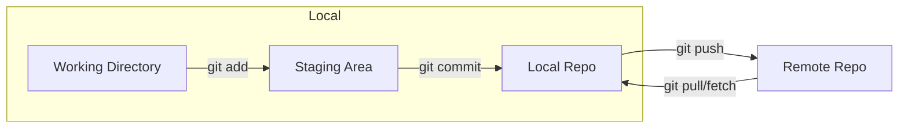

# Resumen Maestro: Git y el Ciclo de Vida del Desarrollo

Git es un sistema de control de versiones distribuido que rastrea los cambios en tu código mediante "instantáneas" (snapshots). Es la base de la colaboración profesional.

## 1. El Modelo Mental de Git: Los 3 Estados

Para usar Git con éxito, debes entender dónde residen tus cambios en cada momento.

1.  **Working Directory:** Tu carpeta de trabajo actual. Los archivos están "untracked" (sin seguimiento) o "modified".
2.  **Staging Area (Index):** El "limbo" o área de preparación. Aquí preparas lo que irá en el siguiente commit.
3.  **Local Repository (Committed):** Git ha guardado una instantánea permanente en la carpeta `.git`.

## 2. Comandos Esenciales de Configuración y Trabajo

*   `git init`: Crea un nuevo repositorio.
*   `git status`: **El comando más importante**. Úsalo constantemente para saber en qué estado están tus archivos.
*   `git add <archivo>` o `git add .`: Mueve cambios al Staging Area.
*   `git commit -m "Mensaje descriptivo"`: Guarda los cambios permanentemente.
    *   *Pro Tip:* Usa mensajes en presente imperativo: "Add login feature" en lugar de "Added login feature".

## 3. Ramas y Desarrollo Paralelo

Las ramas permiten experimentar sin romper el código que ya funciona (rama `main`).

*   `git switch -c feature/nueva-idea`: Crea y cambia a una nueva rama.
*   `git switch main`: Vuelve a la rama principal.
*   **HEAD:** Es el puntero que indica en qué rama/commit estás trabajando ahora.

## 4. Integración: ¿Merge o Rebase?

| Característica | **Merge** (`git merge`) | **Rebase** (`git rebase`) |
| :--- | :--- | :--- |
| **Resultado** | Crea un nuevo "Commit de Fusión". | Reaplica commits uno a uno sobre la base nueva. |
| **Historial** | Preserva la historia real de bifurcación (no lineal). | Crea un historial limpio y lineal (reescribe la historia). |
| **Uso Ideal** | Ramas compartidas con el equipo. | Ramas locales antes de integrarlas al equipo. |
| **Riesgo** | Genera muchos commits de "Merge". | **Peligroso** en ramas que otros ya están usando. |

## 5. Gestión de Emergencias y Errores

*   **`git stash`**: "¿Necesitas cambiar de rama pero no quieres hacer commit todavía?". Guarda tus cambios en una "pila" temporal y limpia tu directorio.
    *   `git stash pop` para recuperarlos.
*   **`git revert <hash>`**: Deshace un commit creando uno nuevo que hace lo contrario. Es la forma más segura de corregir errores en equipo.
*   **`git reset --hard HEAD~1`**: Borra el último commit y todos sus cambios. **¡Cuidado!** No hay vuelta atrás.

## 6. Flujo Gitflow Simplificado (Estándar de la Industria)

1.  **`main`**: Siempre estable. Nunca se trabaja aquí directamente.
2.  **`dev`**: Integración de nuevas funciones.
3.  **`feature/`**: Ramas de corta duración para una sola tarea.
4.  **`bugfix/`**: Ramas para arreglar errores.

### Checklist para un Commit de Calidad:
- [ ] ¿He revisado los cambios con `git status`?
- [ ] ¿El commit hace una sola cosa (es atómico)?
- [ ] ¿El mensaje describe qué hace el cambio (no cómo lo hice)?
- [ ] ¿He evitado incluir archivos basura (`node_modules`, `.env`) usando un `.gitignore`?

---
*Git no es difícil, es metódico. Practica el ciclo **Add -> Status -> Commit -> Status** hasta que sea automático.*

