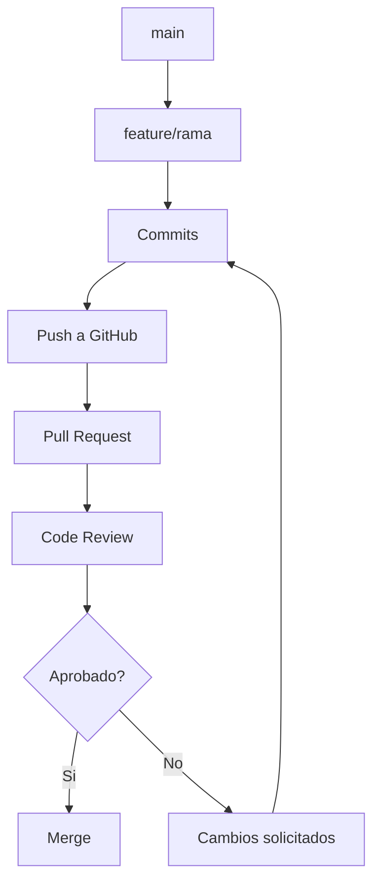

# Guia Docente: GitHub y Colaboracion Profesional

Este documento organiza el modulo como guia para clase online.
El foco es pasar de Git local a colaboracion real con flujo de trabajo profesional en GitHub.

## 1. Objetivos de aprendizaje

Al finalizar la clase, el estudiante deberia poder:

- Diferenciar claramente Git (herramienta) y GitHub (plataforma colaborativa).
  Como explicarlo: separa funciones locales de control de versiones frente a funciones de colaboracion en la nube.
- Aplicar GitHub Flow con ramas, pull requests y revisiones.
  Como explicarlo: recorre el flujo completo desde rama feature hasta merge en main.
- Crear PRs claros con contexto tecnico y criterios de validacion.
  Como explicarlo: usa plantilla fija para asegurar contexto, cambios, pruebas y riesgos.
- Participar en code review con feedback accionable y respetuoso.
  Como explicarlo: diferencia comentarios bloqueantes de sugerencias y propone alternativas concretas.
- Entender el rol de Issues, Projects y Actions en un equipo.
  Como explicarlo: conecta planificacion, ejecucion y validacion automatica en un mismo ciclo de trabajo.

## 2. Mapa tematico de la sesion

1. Ecosistema GitHub: repos, issues, PRs, actions.
2. GitHub Flow de extremo a extremo.
3. Pull Requests: estructura, descripcion y evidencia.
4. Code review: calidad, riesgos y aprobacion.
5. Integracion continua y validaciones automaticas.

## 3. Guion sugerido para clase online (90 minutos)

### Bloque A (15 min): Panorama general

- Definir que problema resuelve GitHub sobre Git puro: colaboracion asincrona.
  Como explicarlo: compara trabajo individual local con coordinacion de equipo en repositorio compartido.
- Mostrar la anatomia de un repositorio (code, issues, pull requests, actions).
  Como explicarlo: navega cada pestaña y explica que decision del equipo ocurre en cada una.

### Bloque B (20 min): GitHub Flow

- Crear rama desde `main`.
  Como explicarlo: justifica aislamiento de cambios para evitar romper la rama estable.
- Desarrollar cambios pequenos y hacer push.
  Como explicarlo: recomienda commits cortos para revisar y revertir con menor riesgo.
- Abrir PR contra `main` con descripcion tecnica.
  Como explicarlo: exige objetivo, alcance, pruebas y posibles impactos antes de solicitar revision.
- Revisar, corregir y mergear.
  Como explicarlo: muestra ciclo iterativo de feedback hasta cumplir criterios de calidad.

Diagrama de referencia:



### Bloque C (20 min): Pull Request de calidad

- Titulo orientado al cambio real.
  Como explicarlo: redacta titulo con accion y area afectada para facilitar lectura del historial.
- Descripcion con: contexto, solucion, impacto y pruebas.
  Como explicarlo: obliga a justificar por que se hizo y como verificar que funciona.
- Checklist minimo para evitar regresiones.
  Como explicarlo: usa checklist como puerta de salida antes de aprobar.

Plantilla sugerida para PR:

```md
## Contexto
## Cambios realizados
## Como probarlo
## Riesgos conocidos
## Checklist
- [ ] Test local
- [ ] Sin secretos ni archivos temporales
```

### Bloque D (20 min): Code review efectivo

- Diferenciar comentarios bloqueantes vs sugerencias.
  Como explicarlo: etiqueta cada comentario segun severidad para priorizar correcciones.
- Revisar logica, seguridad, mantenibilidad y cobertura de pruebas.
  Como explicarlo: aplica una lista de control para no centrarse solo en estilo.
- Mantener tono profesional y accionable.
  Como explicarlo: formula feedback en formato problema, impacto y propuesta.

### Bloque E (15 min): CI/CD basico con Actions

- Explicar que Actions automatiza checks (lint, test, build).
  Como explicarlo: muestra un workflow simple y que garantia aporta cada check.
- Reforzar regla: no mergear en rojo.
  Como explicarlo: conecta fallos de CI con riesgo de regresion en produccion.

## 4. Actividades practicas para la clase

### Actividad 1 (equipos, 15 min)

Abrir una PR con plantilla completa y evidencia de pruebas.

### Actividad 2 (equipos cruzados, 12 min)

Cada equipo revisa la PR de otro y deja feedback tecnico estructurado.

### Actividad 3 (individual, 8 min)

Clasificar comentarios de review en: bloqueante, mejora, pregunta.

## 5. Preguntas de comprobacion rapida

- Que informacion minima no puede faltar en una PR profesional?
- Cual es la diferencia entre hacer `push` y abrir una PR?
- Que significa que un check de CI falle y como impacta el merge?
- Cuando corresponde solicitar cambios en lugar de aprobar?

## 6. Errores frecuentes y como corregirlos

- Error: abrir PR sin contexto ni pasos de prueba.
  Correccion: usar plantilla fija de PR en todos los repos.
- Error: revisar solo estilo y omitir riesgos funcionales.
  Correccion: checklist de review por categorias (logica, seguridad, test).
- Error: mezclar multiples features en una sola PR.
  Correccion: PRs pequenas y enfocadas por objetivo.

## 7. Cierre para la sesion

- Mensaje clave: GitHub profesionaliza la colaboracion, no solo hospeda codigo.
- Resultado esperado: PRs claras, reviews utiles y merges seguros.
- Tarea sugerida: crear una issue, resolverla en rama, abrir PR y revisar la de un companero.
