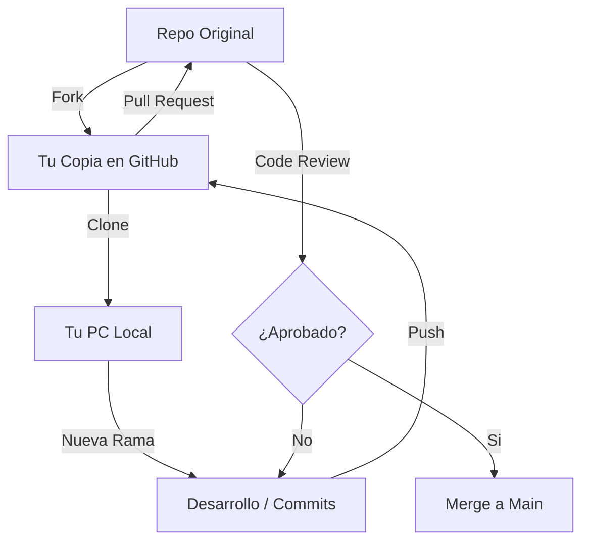

# Resumen Maestro: GitHub y Colaboración Profesional

GitHub es la plataforma que transforma Git (herramienta local) en un entorno social y colaborativo de alto rendimiento.

## 1. El Ecosistema de GitHub
GitHub no es solo código; es una suite de herramientas para la gestión de proyectos:
*   **Repositorios:** El contenedor de tu proyecto.
*   **Issues:** Seguimiento de tareas, errores y debates.
*   **Pull Requests (PR):** Propuestas de cambios para revisión.
*   **GitHub Actions:** Automatización de pruebas y despliegues (CI/CD).

## 2. Flujo de Trabajo Colaborativo (GitHub Flow)

El flujo profesional estándar sigue estos pasos:



## 3. Pull Requests: El Corazón de la Revisión de Código
Un Pull Request no es solo "pedir que unan mi código", es una oportunidad de aprendizaje.

### Anatomía de un buen PR:
1.  **Título Claro:** "Fix: Alineación del logo en móviles".
2.  **Descripción:** ¿Qué problema resuelve?, ¿Cómo se probó?, capturas de pantalla si es visual.
3.  **Palabras Mágicas:** Usar `Closes #123` en la descripción cerrará automáticamente el Issue relacionado cuando el PR se acepte.
4.  **Draft PR:** Si tu trabajo no está terminado pero quieres feedback temprano, ábrelo como "Draft" (Borrador).

## 4. Gestión de Tareas con Issues
Los Issues son la "to-do list" del proyecto.
*   **Etiquetas (Labels):** `bug`, `enhancement`, `help wanted`.
*   **Asignación:** Quién es el responsable.
*   **Milestones:** Agrupar Issues por fechas de lanzamiento (ej. "Versión 1.0").

## 5. Resolución de Conflictos en GitHub
Los conflictos ocurren cuando dos personas editan la misma línea.
*   **Conflictos Simples:** Se pueden resolver directamente en la interfaz web de GitHub.
*   **Conflictos Complejos:** Deben resolverse localmente:
    1. `git pull origin main` (traer lo nuevo).
    2. Resolver marcas `<<<<<<< HEAD` en tu editor.
    3. `git add` -> `git commit` -> `git push`.

## 6. Sincronización Avanzada (Upstream)
Si hiciste un **Fork**, tu copia se desactualiza rápido. Necesitas el remoto `upstream`:
```bash
# Agregar el repo original como 'upstream'
git remote add upstream https://github.com/ORIGINAL/REPO.git

# Traer los cambios del original y fusionarlos
git fetch upstream
git merge upstream/main
```

## 7. Seguridad y Buenas Prácticas
*   **`.gitignore`**: Es OBLIGATORIO. Nunca subas `env`, `dist`, `node_modules` o credenciales.
*   **README.md**: Es la cara de tu proyecto. Debe incluir:
    *   ¿Qué es el proyecto?
    *   ¿Cómo se instala / ejecuta?
    *   ¿Cómo se contribuye?
*   **Ramas de Protección:** Configura GitHub para que nadie pueda hacer `push` directo a `main` sin un PR aprobado.

---
*GitHub es donde ocurre la magia del código abierto y el trabajo en equipo. Tu perfil de GitHub es tu currículum como desarrollador.*

