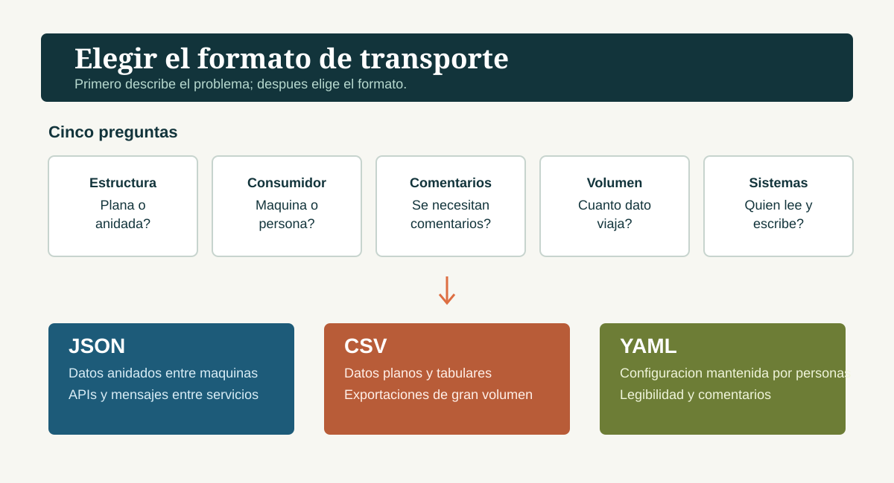
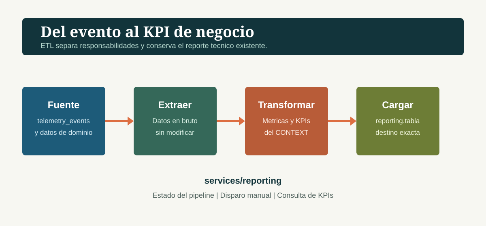
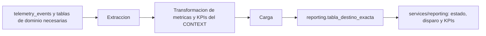
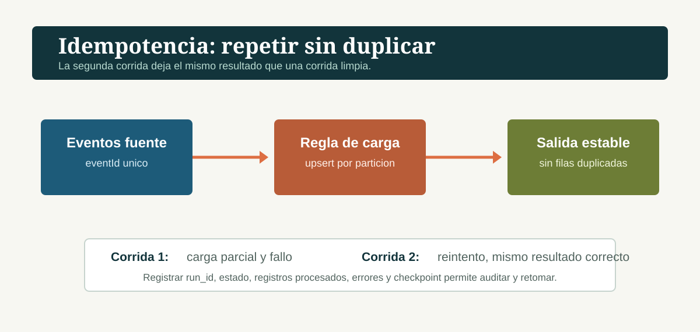

# Clase 48: Diseñar un pipeline de datos de negocio

## Hilo de continuidad

En las clases previas se capturaron eventos de telemetria, se almacenaron en `telemetry_events` y se generaron reportes tecnicos para ingenieria. Esta clase no reemplaza ese trabajo: decide como transportar y almacenar datos, como estructurarlos y como disenar un pipeline nuevo que convierta la misma telemetria en informacion para negocio.

**Frase de transicion para decir en clase**

> Ya tenemos telemetria y un reporte para ingenieria. Ahora cambiamos de audiencia y de pregunta: el pipeline nuevo lee esa fuente, pero debe producir indicadores de negocio que una persona no tecnica pueda usar. Antes de automatizarlo, tenemos que justificar cada decision de formato, base de datos, estructura y etapas.

## Fuentes y limite de trazabilidad

Esta guia usa exclusivamente los contenidos extraidos en esta carpeta:

- `choosing_the_right_data_transport_format.json`: JSON, CSV y YAML y sus criterios de seleccion.
- `choosing_the_right_database.json`: SQL, NoSQL y cargas de trabajo de reportes, integridad y alta lectura.
- `database_normalization.json`: 1FN, 3FN y desnormalizacion deliberada.
- `introduction_to_data_pipelines.json`: pipeline, lotes, streaming y componentes ETL.
- `ai-eng-data-pipeline-design_project_README.es.md`: brief y criterios del proyecto.

Los tutoriales no contienen prompts para OpenClaw. Por tanto, esta guia no propone ninguno: inventarlo incumpliria la restriccion de basarse solo en las fuentes. La agenda, las preguntas y la secuenciacion son estructura pedagogica anadida; el contenido tecnico procede de las fuentes anteriores.

## Objetivos de aprendizaje

Al finalizar, el alumnado podra:

1. Elegir JSON, CSV o YAML con cinco preguntas sobre estructura, consumidor, comentarios, volumen y sistemas participantes.
2. Relacionar una carga de trabajo con una base SQL, documental, clave-valor o columnar sin elegir por popularidad.
3. Distinguir 1FN, 3FN y desnormalizacion segun la mutabilidad y el patron de lectura/escritura.
4. Describir un pipeline ETL con extraccion, transformacion y carga, y justificar lotes frente a streaming.
5. Preparar el diseno de `data/pipelines/PIPELINE_DESIGN.md` solicitado por el proyecto.

## Preparacion del profesor

- Tener disponibles los cinco archivos fuente enumerados arriba y el `CONTEXT-company.md` correspondiente a la empresa del equipo.
- Confirmar que el alumnado trabaja en su copia del monorepo de la compania, no en un repositorio nuevo.
- Recordar que el proyecto pide un documento de diseno, no codigo de orquestacion.

Comando que el brief pide ejecutar al inicio:

```bash
git pull
```

**Contingencia:** si no se puede acceder al monorepo o al contexto de empresa, hacer las cuatro decisiones y el diagrama con los nombres `telemetry_events`, `reporting` y una tabla destino pendiente de reemplazar. No inventar KPIs, audiencia, frecuencia ni nombre de tabla: esos datos deben salir de `CONTEXT-company.md`.

## Agenda

| Tiempo | Bloque | Resultado visible |
| --- | --- | --- |
| 0-8 min | Continuidad y audiencia | Separacion entre reporte tecnico y pipeline de negocio |
| 8-18 min | Formato de transporte | Decision razonada entre JSON, CSV y YAML |
| 18-30 min | Base de datos y estructura | Eleccion por carga de trabajo; 1FN/3FN |
| 30-43 min | Pipeline y ETL | Diagrama de extraccion, transformacion y carga |
| 43-57 min | Diseno del proyecto | Checklist de `PIPELINE_DESIGN.md` |
| 57-60 min | Cierre | Respuestas de comprobacion |

La version extendida usa los 15 minutos adicionales para resolver los escenarios de normalizacion y resiliencia del final de esta guia.

## Guion docente

### 0-8 min: Del reporte tecnico al resultado de negocio

**Que decir (literal)**

> `telemetry_events` sigue siendo la fuente. El endpoint `GET /telemetry/report` y `services/telemetry/analysis.py` siguen sirviendo a ingenieria y no se modifican. El nuevo pipeline debe producir otra salida, bajo el esquema `reporting`, para una audiencia de negocio.

Explicar que el documento debe empezar por el estado actual: eventos capturados, ubicacion de almacenamiento, que responde el reporte tecnico y la pregunta de negocio que todavia queda abierta. La pregunta, KPIs, audiencia, cadencia, granularidad y nombre exacto de la tabla destino deben tomarse del `CONTEXT-company.md` del equipo.

**Pregunta de chequeo:** "Si `telemetry_events` es la fuente, por que no debe ser tambien el destino del pipeline?"

Respuesta esperada: porque el brief exige tablas de destino nuevas bajo `reporting`; es un pipeline nuevo y no un reemplazo del reporte tecnico.

### 8-18 min: Seleccionar el formato de transporte

Un formato de transporte define como se estructura y representa la informacion cuando se mueve entre sistemas. Las tres propiedades que compara el tutorial son soporte estructural, legibilidad humana y costo de analisis.



**Que decir (literal)**

> No empezamos por el formato favorito. Empezamos por cinco preguntas: si los datos son planos o anidados, quien los consume, si necesita comentarios, que volumen se transporta y que sistemas deben leer o escribir.

Presentar el mismo contacto en los tres formatos:

```json
{
  "name": "Ana",
  "email": "ana@example.com",
  "roles": ["admin", "user"]
}
```

```csv
name,email,roles
Ana,ana@example.com,"admin,user"
```

```yaml
name: Ana
email: ana@example.com
roles:
  - admin
  - user
```

Explicar directamente lo que muestra el ejemplo: JSON y YAML representan estructuras anidadas; CSV aplana la lista. JSON es apropiado para datos anidados entre maquinas y APIs; CSV para datos planos y tabulares de gran volumen; YAML para configuracion mantenida por personas cuando importan legibilidad y comentarios.

**Pregunta de chequeo:** "Para una configuracion que el equipo debe leer, comentar y modificar, que formato encaja y que condicion de sintaxis hay que vigilar?"

Respuesta esperada: YAML; usa indentacion con espacios y no permite tabulaciones.

### 18-30 min: Elegir almacenamiento y estructura

Una carga de trabajo describe como la aplicacion escribe, lee, consulta y transforma datos. El tutorial separa tres casos: reportes, integridad primero y muchas consultas.

**Que decir (literal)**

> SQL y NoSQL no son una eleccion de identidad. SQL encaja con datos estructurados, relaciones, claves foraneas y garantias ACID. NoSQL ofrece estructuras flexibles como documentos, clave-valor, columnas anchas o grafos. La pregunta es que carga de trabajo vamos a servir.

Relacionar los casos del material:

- Para reportes y agregaciones sobre grandes conjuntos de datos, el tutorial presenta almacenamiento columnar como BigQuery: permite escanear solo las columnas necesarias.
- Para integridad, SQL aplica relaciones, restricciones y transacciones. ACID significa atomicidad, consistencia, aislamiento y durabilidad.
- Para muchas lecturas, el material propone replicas de lectura y cache como Redis.

Usar esta tabla de ejemplo para introducir 1FN:

```sql
CREATE TABLE orders (
  id INT PRIMARY KEY,
  customer_id INT,
  product_ids VARCHAR(255)
);
```

`product_ids` con valores como `1,4,7` viola la Primera Forma Normal: una celda debe contener un valor atomico y no deben existir grupos repetidos. La correccion que ofrece el tutorial es mover cada producto a una tabla de union:

```sql
CREATE TABLE order_items (
  order_id INT,
  product_id INT,
  PRIMARY KEY (order_id, product_id)
);
```

Para 3FN, explicar que una dependencia transitiva ocurre cuando una columna no clave depende de otra columna no clave y no directamente de la clave primaria. En `employees(id, name, department_id, department_name, department_budget)`, los datos de departamento dependen de `department_id`; se separan en una tabla de departamentos y se conserva una clave foranea.

**Que decir (literal)**

> Para datos transaccionales que se actualizan, 3FN es el punto de partida porque evita anomalias de actualizacion. Para registros inmutables, solo de anexado, como eventos de clic, 1FN puede ser suficiente. Desnormalizar es una decision deliberada para muchas lecturas o reportes, no una excusa para duplicar datos sin control.

**Pregunta de chequeo:** "Que condicion del uso de los datos hace que 1FN pueda ser suficiente para una tabla de eventos?"

Respuesta esperada: que cada fila se escriba una vez y nunca se actualice, manteniendo valores atomicos.

### 30-43 min: Diseñar el flujo ETL

Una tuberia es una secuencia automatizada y estructurada que mueve datos de una o varias fuentes a destinos y aplica transformaciones. Debe ser automatizada, repetible y observable. El patron ETL separa responsabilidades:



- **Extractor:** conecta con bases de datos, APIs, archivos o flujos; recupera datos en bruto sin transformarlos; maneja conexion, reintentos y validacion del esquema esperado.
- **Transformador:** aplica las transformaciones necesarias a los datos extraidos.
- **Cargador:** entrega el resultado transformado a su destino.

**Que decir (literal)**

> Separar ETL evita una tuberia opaca. El extractor no limpia ni agrega: recupera. La transformacion prepara los datos para la pregunta de negocio. La carga escribe la salida en la tabla de reporting, nunca de vuelta en `telemetry_events`.

Dibujar esta estructura y reemplazar los marcadores por los nombres del contexto de cada empresa:



Contrastar los dos modos sin decidir por defecto:

- Lotes: recopilan datos durante un periodo y los procesan de una vez; ofrecen alto rendimiento y simplicidad, a cambio de mayor latencia. El material cita reportes de ventas al final del dia y reentrenamiento semanal.
- Streaming: procesa eventos continuamente con baja latencia y mayor complejidad.

**Pregunta de chequeo:** "Que requisito determina si la frescura de un KPI puede resolverse por lotes o necesita procesamiento continuo?"

Respuesta esperada: la frescura requerida por el entregable y su frecuencia, definidos en el `CONTEXT-company.md`.

### 43-57 min: Convertir el brief en un diseno evaluable

El entregable de esta parte es `data/pipelines/PIPELINE_DESIGN.md`, en Markdown y dentro del monorepo. No se implementa aun codigo de orquestacion.

**Que decir (literal)**

> El diseno solo es util si otra persona puede comprobar que no duplica datos, que deja rastros y que puede retomar despues de un fallo. Por eso debemos documentar idempotencia, observabilidad y recuperabilidad, no solo dibujar tres cajas ETL.

Recorrer este checklist del proyecto:

1. **Estado actual y brecha:** eventos existentes, `telemetry_events`, alcance del reporte tecnico y pregunta de negocio pendiente.
2. **Proposito:** una sola frase con entregable de negocio, KPI o KPIs y metricas obligatorias del contexto de la empresa.
3. **Extraccion y flujo:** tablas origen, formato del payload, cadencia y diagrama con extraccion, transformacion y carga.
4. **Destino e integracion:** tabla nueva bajo `reporting` con el nombre exacto del contexto y tres endpoints en `services/reporting/`: estado, disparo manual y consulta de KPIs. Los endpoints importan funciones o flows de `data/pipelines/`; no contienen logica ETL.
5. **Idempotencia:** especificar que sucede al reintentar una carga parcial. El brief ofrece como direccion un upsert por clave de particion diaria y deduplicacion por `eventId` en la ingesta.



6. **Observabilidad:** definir un log de corrida con, como minimo, hora de inicio, hora de fin, registros procesados, estado y errores. El nombre, tipo y motivo de cada campo deben aparecer en el diseno.
7. **Recuperabilidad:** indicar checkpoint de fase y como retomar despues de una caida de base de datos.
8. **Prefect:** un flow principal, al menos tres tasks (extraccion, transformacion y carga), estados `Running`, `Completed` y `Failed`, y blocks para configuracion o credenciales como la conexion a Supabase.

Mini plan en pseudocodigo, alineado al brief:

```text
leer CONTEXT-company.md
documentar estado de telemetry_events y reporte tecnico existente
definir entregable, audiencia, frecuencia, KPI y tabla reporting exacta
disenar extract -> transform -> load
definir clave de deduplicacion, upsert y ventana de recalculo
definir log de corrida y checkpoint de fase
mapear flow y tasks de Prefect
esbozar endpoints de estado, disparo manual y consulta de KPIs
escribir data/pipelines/PIPELINE_DESIGN.md
```

### 57-60 min: Cierre

**Que decir (literal)**

> El pipeline no se justifica porque mueva datos; se justifica porque entrega un KPI concreto a una audiencia concreta, de manera repetible, auditable y recuperable. La proxima tarea es reemplazar los marcadores del diseno por el vocabulario real de vuestra empresa.

Preguntas de salida:

1. Nombra una diferencia entre la salida del reporte tecnico y la del pipeline de negocio.
2. Que cinco preguntas permiten elegir un formato de transporte?
3. Que separa 1FN de 3FN?
4. Cuales son las tres etapas minimas y las tres propiedades de un pipeline robusto?
5. Que tres endpoints debe disenar `services/reporting/`?

## Extension hasta 75 minutos

Usar 15 minutos adicionales para que parejas respondan, con los nombres reales del contexto, estas situaciones del brief:

- **Reintento tras carga parcial:** una corrida cargo 847 de 1,412 filas y fallo. Pedir que describan la clave de particion o estrategia de upsert que permite repetir la corrida sin duplicar datos.
- **Evento tardio:** un evento llega con timestamp de mediodia cuando el agregado diario ya fue publicado. Pedir una ventana de recalculo y el rastro de auditoria que registraria la corrida que invalida el resultado.
- **Corridas concurrentes:** un cron y un disparo manual se solapan. Pedir un lock por ventana y un `run_id` unico.

Cerrar solicitando que cada equipo anote la seccion de su documento donde respondera a cada escenario.

## Lista de control final para el profesor

- La clase mantuvo separados el reporte tecnico existente y el nuevo pipeline de negocio.
- Se uso `CONTEXT-company.md` para todo nombre, KPI, frecuencia y tabla especificos de la empresa.
- Se explicaron JSON, CSV, YAML, carga de trabajo, 1FN, 3FN, ETL y lotes frente a streaming usando las fuentes de la clase.
- El alumnado sabe que el resultado se documenta en `data/pipelines/PIPELINE_DESIGN.md` y no es codigo de orquestacion aun.
- El diseno incluye idempotencia, observabilidad, recuperabilidad, Prefect y los tres endpoints de `services/reporting/`.